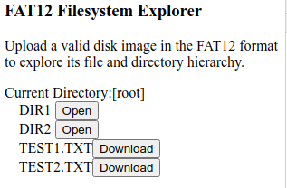

FilesystemExplorerFAT12
=======================

The JavaScript code in this repository implements a utility to view the contents of a FAT12 filesystem.

Note that, as of this writing, there is a serious bug where only the root directory's contents are parsed correctly.

Using
-----

To use the software, it may be necessary to generate a disk image file, which typically use the .img extension.  To create one, follow the set of steps below for the relevant operating system.  Note that there are multiple ways to create a disk image; these are only suggestions.

Alternatively, a sample disk image file is provided in the Samples directory.

Linux
-----

1. Run the command "dd if=/dev/zero of=FilesystemFAT12.img bs=1M count=1" to create a one-mebibyte file containing all zeroes.
2. Enter the command "fdisk FilesystemFAT12.img" to start an fdisk session.
3. In fdisk, enter the command "n" to create a new partition.
4. Press the enter key four times to accept the defaults: partition type "primary", partition number 1, first sector 1, and last sector 2047.
5. Still in fdisk, enter the command "t" to change the type of the partition.
6. Enter the type code "1" to change the partition to a FAT12 partition.
7. Enter the command "w" to write the specified changes to the disk image file and end the fdisk session.
8. Back at the system command prompt, enter the command "mkfs --type=fat FilesystemFAT12.img".
9. Run the command "mkdir FilesystemFAT12" to create a directory to mount the disk image to.
10. Run the command "sudo mount FilesystemFAT12.img FilesystemFAT12" to mount the disk image to the newly created directory.
11. In the File Explorer, right-click, the FilesystemFAT12 directory and select "Open as root" from the context menu that appears, then supply the root password.
12. Create some directories and simple test files (perhaps .txt files) on the mounted drive.
13. Back at the command prompt, run the command "sudo umount FilesystemFAT12" to unmount the disk image.

Microsoft Windows
-----------------

1. Download OSFMount, by PassMark Software.
2. Install OSFMount.
3. Start up OSFMount.
4. Click the "Mount new..." button.
5. Selected the "Empty RAM drive" radio button.
6. Specify a disk size of one megabyte.
7. Make a note of the drive letter.  These instructions assume "E:".  If otherwise, change the command text in step 10 accordingly."
8. Click OK to dismiss the dialog.
9. Open a command prompt window.
10. In the command window, format the newly mounted drive by running "format E: /FS:FAT", responding to the prompts when necessary. (Always be extra careful with the "format" command!)
11. Create some directories and simple test files (perhaps .txt files) on the mounted drive.
12. Back in OSFMount, right-click the mounted drive and select the "Save to image file..." item from the context menu that appears.
13. Specify a file name for the disk image.
